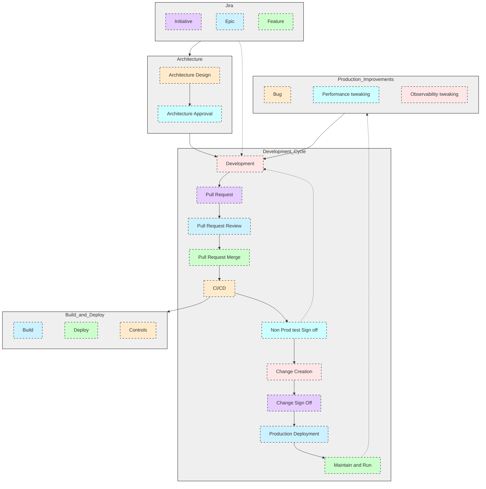

```mermaid
flowchart TB
 subgraph Development_Cycle["Development_Cycle"]
    direction TB
        G["Pull Request"]
        F["Development"]
        H["Pull Request Review"]
        I["Pull Request Merge"]
        J["CI/CD"]
        K["Non Prod test Sign off"]
        L["Change Creation"]
        M["Change Sign Off"]
        N["Production Deployment"]
        O["Maintain and Run"]
  end
 subgraph Architecture["Architecture"]
    direction TB
        E["Architecture Approval"]
        D["Architecture Design"]
  end
 subgraph Jira["Jira"]
    direction TB
        A["Initiative"]
        B["Epic"]
        C["Feature"]
  end
 subgraph Production_Improvements["Production_Improvements"]
        Q["Performance tweaking"]
        P["Bug"]
        R["Observability tweaking"]
  end
 subgraph Build_and_Deploy["Build_and_Deploy"]
    direction LR
        T["Deploy"]
        W["Build"]
        S["Controls"]
  end
    F --> G
    G --> H
    H --> I
    I --> J
    J --> K & Build_and_Deploy
    K -.-> F
    K --> L
    L --> M
    M --> N
    N --> O
    D --> E
    Architecture --> F
    Jira --> Architecture
    Jira -.-> F
    Production_Improvements --> F
    O -.-> Production_Improvements
    P ~~~ Q
    Q ~~~ R
    W ~~~ T
    T ~~~ S
    style G fill:#e6ccff,stroke:#000,stroke-width:1px,stroke-dasharray: 5 5
    style F fill:#ffe6e6,stroke:#000,stroke-width:1px,stroke-dasharray: 5 5
    style H fill:#ccf2ff,stroke:#000,stroke-width:1px,stroke-dasharray: 5 5
    style I fill:#ccffcc,stroke:#000,stroke-width:1px,stroke-dasharray: 5 5
    style J fill:#ffebcc,stroke:#000,stroke-width:1px,stroke-dasharray: 5 5
    style K fill:#ccffff,stroke:#000,stroke-width:1px,stroke-dasharray: 5 5
    style L fill:#ffe6e6,stroke:#000,stroke-width:1px,stroke-dasharray: 5 5
    style M fill:#e6ccff,stroke:#000,stroke-width:1px,stroke-dasharray: 5 5
    style N fill:#ccf2ff,stroke:#000,stroke-width:1px,stroke-dasharray: 5 5
    style O fill:#ccffcc,stroke:#000,stroke-width:1px,stroke-dasharray: 5 5
    style E fill:#ccffff,stroke:#000,stroke-width:1px,stroke-dasharray: 5 5
    style D fill:#ffebcc,stroke:#000,stroke-width:1px,stroke-dasharray: 5 5
    style A fill:#e6ccff,stroke:#000,stroke-width:1px,stroke-dasharray: 5 5
    style B fill:#ccf2ff,stroke:#000,stroke-width:1px,stroke-dasharray: 5 5
    style C fill:#ccffcc,stroke:#000,stroke-width:1px,stroke-dasharray: 5 5
    style Q fill:#ccffff,stroke:#000,stroke-width:1px,stroke-dasharray: 5 5
    style P fill:#ffebcc,stroke:#000,stroke-width:1px,stroke-dasharray: 5 5
    style R fill:#ffe6e6,stroke:#000,stroke-width:1px,stroke-dasharray: 5 5
    style T fill:#ccffcc,stroke:#000,stroke-width:1px,stroke-dasharray: 5 5
    style W fill:#ccf2ff,stroke:#000,stroke-width:1px,stroke-dasharray: 5 5
    style S fill:#ffebcc,stroke:#000,stroke-width:1px,stroke-dasharray: 5 5
    style Build_and_Deploy stroke:#000,fill:#eeee
    style Architecture fill:#eeee, stroke:#000
    style Jira fill:#eeee, stroke:#000
    style Production_Improvements fill:#eeee, stroke:#000
    style Development_Cycle fill:#eeee, stroke:#000


```
