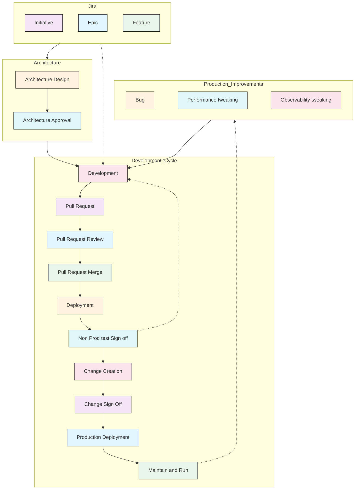

```mermaid
graph 
direction LR
subgraph Development_Cycle
        direction TB
        style F fill:#fce4ec,stroke:#000,stroke-width:1px
        style G fill:#f3e5f5,stroke:#000,stroke-width:1px
        style H fill:#e1f5fe,stroke:#000,stroke-width:1px
        style I fill:#e8f5e9,stroke:#000,stroke-width:1px
        style J fill:#fff3e0,stroke:#000,stroke-width:1px
        style K fill:#e0f7fa,stroke:#000,stroke-width:1px
        style L fill:#fce4ec,stroke:#000,stroke-width:1px
        style M fill:#f3e5f5,stroke:#000,stroke-width:1px
        style N fill:#e1f5fe,stroke:#000,stroke-width:1px
        style O fill:#e8f5e9,stroke:#000,stroke-width:1px
        F[Development] --> G[Pull Request]
        G --> H[Pull Request Review]
        H --> I[Pull Request Merge]
        I --> J[Deployment]
        J --> K[Non Prod test Sign off]
        K -.-> F
        K --> L[Change Creation]
        L --> M[Change Sign Off]
        M --> N[Production Deployment]
        N --> O[Maintain and Run]
    end
subgraph Architecture
direction TB
        style D fill:#fff3e0,stroke:#000,stroke-width:1px
        style E fill:#e0f7fa,stroke:#000,stroke-width:1px
        D[Architecture Design] --> E[Architecture Approval]
        E[Architecture Approval] 
    end
subgraph Jira
direction TB
        style A fill:#f3e5f5,stroke:#000,stroke-width:1px
        style B fill:#e1f5fe,stroke:#000,stroke-width:1px
        style C fill:#e8f5e9,stroke:#000,stroke-width:1px
        A[Initiative] 
        B[Epic] 
        C[Feature]
    end
 
   
  
 
  Architecture --> F
  Jira --> Architecture
  Jira -.-> F
  Production_Improvements --> F
  O -.-> Production_Improvements

    subgraph Production_Improvements
        style P fill:#fff3e0,stroke:#000,stroke-width:1px
        style Q fill:#e0f7fa,stroke:#000,stroke-width:1px
        style R fill:#fce4ec,stroke:#000,stroke-width:1px
        P[Bug] ~~~ Q
        Q[Performance tweaking] ~~~ R
        R[Observability tweaking]
    end
   
```
